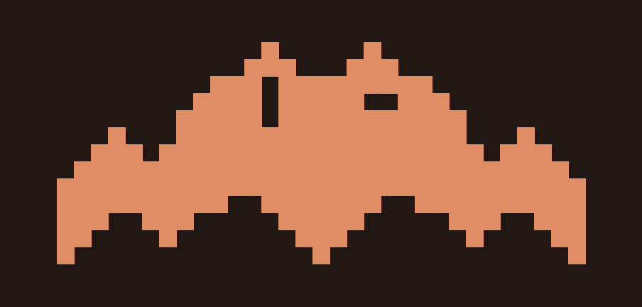

<p align="center">
  
</p>

<h1 align="center">ClaudeBat</h1>

<p align="center">
  <strong>Your Claude usage. One glance away.</strong>
</p>

<p align="center">
  
  
  
</p>

---

macOS menu bar app. Shows your Claude session and weekly usage as retro 8-bit battery bars.

## Install

```
brew install diamondkj/tap/claudebat
```

Or grab the `.dmg` from [Releases](https://github.com/DiamondKJ/ClaudeBat/releases). Needs macOS 14+ and [Claude Code](https://docs.anthropic.com/en/docs/claude-code) logged in.

## What You Get

- Session (5h) and weekly (7d) usage in the menu bar
- Sonnet breakdown, extra usage spend/limit
- Auto-polls every 75s when open, 120s when closed
- No manual refresh. It just works.

## How It Works

Reads your OAuth token from Keychain via `/usr/bin/security` subprocess. Zero prompts.

Polls `GET /api/oauth/usage` on a 5-request/300s sliding window budget. Caches in UserDefaults with 24h TTL. Bypasses local budget on sleep/wake and 5-hour reset boundaries. Always respects server 429.

## Uninstall

```
brew uninstall claudebat
```

---

<p align="center">
  Built by KJ + Claude
</p>
