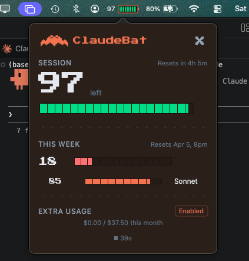

<p align="center">
  
</p>

<h1 align="center">ClaudeBat</h1>

<p align="center">
  <strong>Your Claude usage. One glance away.</strong>
</p>

<p align="center">
  
  
  
</p>

---

<p align="center">
  
</p>

macOS menu bar app. Shows your Claude session and weekly usage as retro 8-bit battery bars.

## Install

```
brew install diamondkj/tap/claudebat
```

That's it. ClaudeBat automatically finds your Claude Code OAuth token from Keychain — no config, no API keys, no setup. Just install and it appears in your menu bar.

Alternatively, grab the `.dmg` from [Releases](https://github.com/DiamondKJ/ClaudeBat/releases) and drag to Applications.

> On first launch, macOS will block it (unsigned app). Go to **System Settings > Privacy & Security** and click **Open Anyway**. One-time only.

Requires macOS 14+ and [Claude Code](https://docs.anthropic.com/en/docs/claude-code) logged in.

## What You Get

- Session (5h) and weekly (7d) usage in the menu bar
- Sonnet breakdown, extra usage spend/limit
- Auto-polls every 65s when open, 120s when closed
- No manual refresh. It just works.

## How It Works

Reads your Claude Code OAuth token straight from macOS Keychain — zero prompts, zero config. If you're logged into Claude Code, ClaudeBat just works.

Polls the usage API on a sliding window budget, caches locally, and auto-refreshes on sleep/wake and session resets.

## Uninstall

```
brew uninstall claudebat
```

---

<p align="center">
  Built by KJ + Claude
</p>
