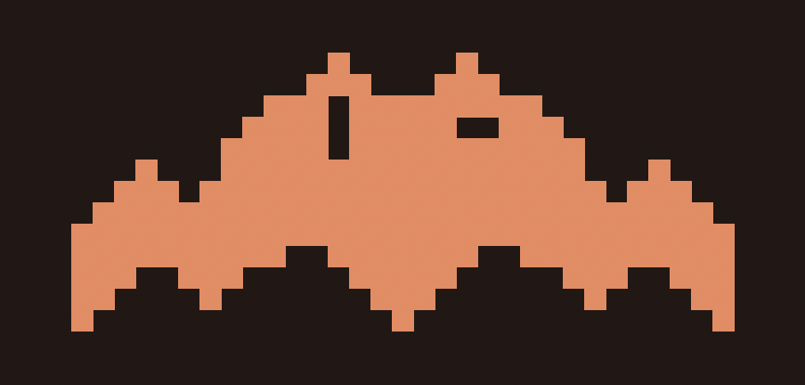
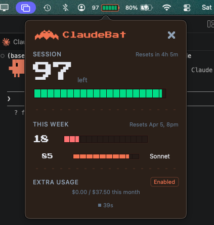

<p align="center">
  
</p>

<h1 align="center">ClaudeBat</h1>

<p align="center">
  <strong>Your Claude usage. One glance away.</strong>
</p>

<p align="center">
  
  
  
</p>

---

<p align="center">
  
</p>

macOS menu bar app. Shows your Claude session and weekly usage as retro 8-bit battery bars.

## Install

```
brew install diamondkj/tap/claudebat
```

That's it. ClaudeBat automatically finds your Claude Code OAuth token from Keychain — no config, no API keys, no setup. Just install and it appears in your menu bar.

Alternatively, grab the `.dmg` from [Releases](https://github.com/DiamondKJ/ClaudeBat/releases) and drag to Applications.

> On first launch, macOS will block it (unsigned app). Go to **System Settings > Privacy & Security** and click **Open Anyway**. One-time only.

Requires macOS 14+ and [Claude Code](https://docs.anthropic.com/en/docs/claude-code) logged in.

## What You Get

- Session (5h) and weekly (7d) usage in the menu bar
- Per-model weekly breakdown (Fable, Sonnet — whatever your plan reports), extra usage spend/limit
- Auto-polls every 65s when open, 120s when closed
- No manual refresh. It just works.

## How It Works

Reads your Claude Code OAuth token straight from macOS Keychain — zero prompts, zero config. If you're logged into Claude Code, ClaudeBat just works.

Polls the usage API on a sliding window budget, caches locally, and auto-refreshes on sleep/wake and session resets.

## Privacy & Credentials

Worth being explicit about, since this app touches your Claude credentials:

- **Reads** your Claude Code OAuth token from the macOS Keychain (the same entry Claude Code manages).
- **If the token has expired**, ClaudeBat refreshes it against Anthropic's official OAuth endpoint and writes the renewed credentials back to that Keychain entry — so both ClaudeBat *and* Claude Code stay logged in.
- **As a last resort** (refresh token missing or rejected), it briefly launches the Claude CLI hidden in the background so Claude Code can repair its own login, then closes it. This happens at most once per 20 minutes, and only binaries in trusted locations are launched.
- **Nothing leaves your machine** except requests to Anthropic (`api.anthropic.com`, `platform.claude.com`). No telemetry, no third-party servers. Diagnostic logs stay local (`~/Library/Logs/ClaudeBat/`) and never contain tokens.

## Uninstall

```
brew uninstall claudebat
```

---

<p align="center">
  Built by KJ + Claude
</p>
